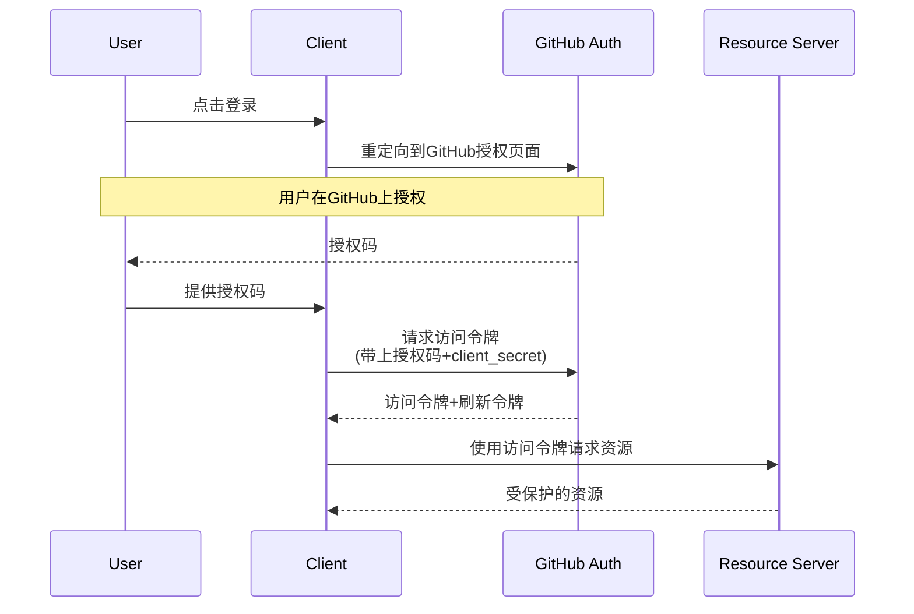

```mermaid
sequenceDiagram
    participant 用户 as User
    participant 客户端 as Client
    participant GitHub as GitHub Auth
    participant 资源服务器 as Resource Server

    用户->>客户端: 点击登录
    客户端->>GitHub: 重定向到GitHub授权页面
    Note over 用户,GitHub: 用户在GitHub上授权

    GitHub-->>用户: 授权码
    用户->>客户端: 提供授权码
    客户端->>GitHub: 请求访问令牌<br/>(带上授权码+client_secret)

    GitHub-->>客户端: 访问令牌+刷新令牌
    客户端->>资源服务器: 使用访问令牌请求资源
    资源服务器-->>客户端: 受保护的资源
```
